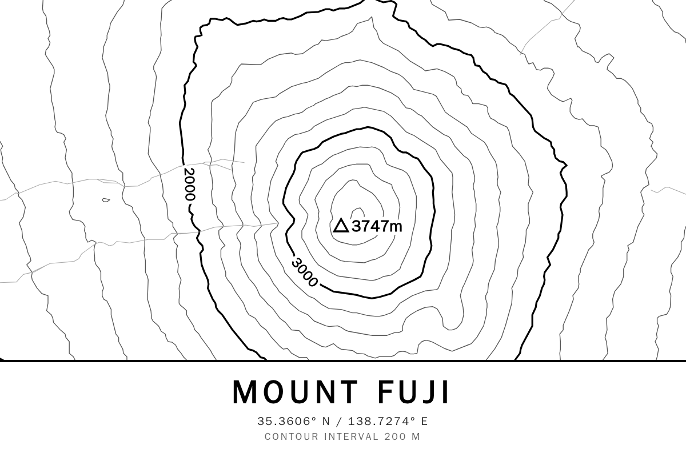

# topo_map

A topographic sheet for any place on earth: contour lines traced from an
elevation model, with water, railways and a road hierarchy drawn over them.

## What it does

Give it a location and a span and it draws that ground as a real topo sheet —
contours at a sensible interval, every fifth one heavy and labelled with its
height, a triangulation mark and spot height on the high point, and a legend
stating the interval. It suits a full-bleed panel as a wall piece or sleep
screen, and drops into a bento layout as a compact tile.

Seven themes ship with it. `mono` sits on the e-ink four-level ramp
(`#000/#555/#AAA/#FFF`) so a greyscale panel maps it one-to-one — contour line
art is about the best thing you can hand a 1-bit display. `survey`, `usgs` and
`blueprint` are printed-sheet palettes; `relief` adds hillshaded ground under
fine contours; `spectra` and `bwry` target panel inks directly. An eighth,
`custom`, takes its whole palette from colour pickers on the cell.

## Configuration

| Option | Type | Notes |
| --- | --- | --- |
| `location` | location search | Resolves as you type. Also accepts `"City, CC"` or a literal `"lat,lon"`. Empty falls back to the app-level location in Settings. |
| `span_m` | number | Ground covered across the long edge. 3000 for a single peak, 8000 for a valley, 30000 for a whole range. |
| `theme` | select | One of the eight above. |
| `interval_m` | number | Height between contours, in the sheet's unit. `0` picks an interval that suits the terrain. |
| `index_every` | number | Draw every nth contour heavy and label it. `0` for an even-weight sheet. |
| `feet` | boolean | Print heights in feet. Contours are always traced in metres; only the labels change. |
| `weight` | slider | Multiplies every stroke width. |
| `show_roads` | boolean | Turn off for a pure terrain sheet. |
| `show_peak` | boolean | Mark the high point with a triangulation symbol and spot height. |
| `show_labels` | boolean | Set index contours with their height. |
| `show_label` / `label` / `show_country` | boolean / string | The name band. |
| `c_*` | colour | Ground, contours, index contours, water, vegetation, roads, railways and name band — used when `theme` is `custom`. |
| `show_parks` / `show_rail` / `show_relief` | boolean | Layer toggles for the `custom` theme. |

Two fragments: `sheet` (map plus the name band) and `map` (map only).

## How it works

Elevation comes from [AWS Terrain Tiles](https://registry.opendata.aws/terrain-tiles/)
in the "terrarium" encoding, where each pixel carries a height as
`(R × 256 + G + B ÷ 256) − 32768` metres. Those are PNGs, and the vector
overlay is Mapbox Vector Tiles — protobuf — so `server.py` carries a reader for
each rather than taking a dependency: a small protobuf reader for the subset of
the wire format MVT uses, and a PNG reader narrowed to the one colour type
terrarium emits.

The DEM is sampled bilinearly into a square grid over the frame, and contours
are traced with marching squares. Each cell is visited once, considering only
the levels that fall between its own lowest and highest corner — tracing one
level at a time means re-walking the whole grid per level, which at a couple of
hundred squares a side does not fit inside a page-render budget. Loose segments
are stitched into polylines, simplified (Ramer–Douglas–Peucker), quantised to a
1000×1000 space and returned as SVG path data; `client.js` only has to paint it.

Draw order is the cartographic one: ground, shaded relief, vegetation, contours,
then water *over* the contours — a lake surface has none — then rail, roads and
the marginalia.

Terrain does not change, so DEM tiles, vector tiles and the finished path data
are all cached on disk and a warm render costs no network at all.

## Coverage

The best global source behind these tiles is SRTM at 1 arc-second (~30 m),
covering 60°N to 56°S. Outside that band the underlying data is coarser and
contours will look correspondingly soft. The first render of a wide, uncached
frame does real work — up to sixteen elevation tiles plus the vector overlay —
so give a cold cell a moment; every render after it is served from cache.

## Attribution

Elevation data from [Terrain Tiles](https://registry.opendata.aws/terrain-tiles/)
on the AWS Registry of Open Data, derived from SRTM, ASTER GDEM, and national
elevation datasets. Map data ©
[OpenStreetMap](https://www.openstreetmap.org/copyright) contributors,
[ODbL](https://opendatacommons.org/licenses/odbl/). Tiles by
[OpenFreeMap](https://openfreemap.org) © [OpenMapTiles](https://openmaptiles.org/).
Geocoding by [Nominatim](https://nominatim.openstreetmap.org).

## Licence

AGPL-3.0-or-later. See [LICENSE](LICENSE).
